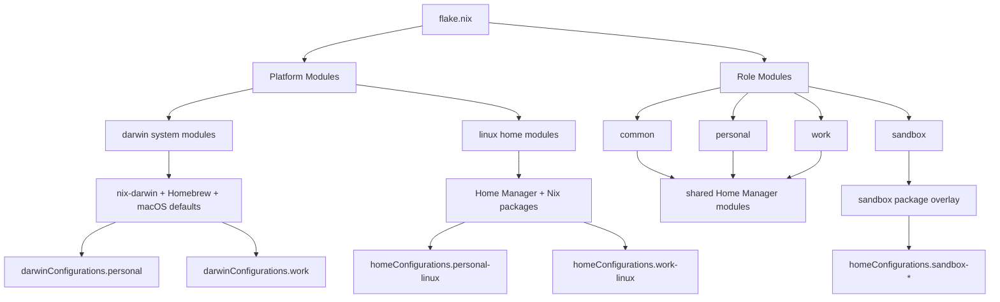

# dotfiles

Managed with Nix using `nix-darwin` for macOS and Home Manager for user configuration.

## Configuration model

This repo composes configuration on two axes:

- **Role**
  - `common` — shared configuration for personal and work machines
  - `personal` — `common + personal`
  - `work` — `common + work`
  - `sandbox` — standalone profile for agent sandboxes
- **Platform**
  - `darwin` — `nix-darwin` system modules, Homebrew integration, macOS defaults
  - `linux` — Home Manager plus Nix packages

The resulting outputs are:

- `darwinConfigurations.personal`
- `darwinConfigurations.work`
- `homeConfigurations.personal-linux`
- `homeConfigurations.personal-aarch64-linux`
- `homeConfigurations.work-linux`
- `homeConfigurations.work-aarch64-linux`
- `homeConfigurations.sandbox-aarch64-darwin`
- `homeConfigurations.sandbox-aarch64-linux`
- `homeConfigurations.sandbox-x86_64-linux`

## Repo layout

```text
.
├── flake.nix
├── bootstrap.sh
├── home/
│   ├── .zshrc
│   ├── .tmux.conf
│   ├── .vimrc
│   ├── .config/
│   ├── .codex/
│   └── .claude/
├── lib/
└── modules/
    ├── shared/
    ├── roles/
    └── platforms/
```

`home/` stores the managed payloads using their real target names, so the tree matches the home directory layout Home Manager deploys.

## Composition



## Bootstrap a new macOS machine

Bootstrap installs Nix, installs Homebrew if needed, builds the Darwin system from this flake, then switches to it:

```bash
./bootstrap.sh personal
./bootstrap.sh work
```

## Day-to-day usage

Apply the Darwin role on macOS:

```bash
darwin-rebuild switch --flake .#personal
darwin-rebuild switch --flake .#work
```

Apply a Linux profile:

```bash
home-manager switch --flake .#personal-linux
home-manager switch --flake .#personal-aarch64-linux
home-manager switch --flake .#work-linux
home-manager switch --flake .#work-aarch64-linux
```

Apply a sandbox profile:

```bash
home-manager switch --flake .#sandbox-aarch64-darwin
home-manager switch --flake .#sandbox-aarch64-linux
home-manager switch --flake .#sandbox-x86_64-linux
```

Update flake inputs:

```bash
nix flake update
```

## Package strategy

- **Darwin** uses Homebrew through `modules/platforms/darwin/homebrew.nix`.
- **Linux** uses Nix packages through `modules/platforms/linux/packages.nix`.
- **Sandbox** stays lean and avoids desktop-specific settings.

Current hidden runtime dependencies are also declared, including `jq`.

## Managed vs unmanaged files

This repo manages a curated subset of `~/.codex` and `~/.claude`.

Examples of intentionally unmanaged local state:

- `~/.codex/config.toml`
- `~/.codex/auth.json`
- `~/.codex/history.jsonl`
- `~/.codex/sessions/**`
- `~/.codex/worktrees/**`
- `~/.codex/sqlite/**`
- `~/.codex/log/**`
- machine-local Claude/Codex runtime state

## Where changes go

- role-specific policy: `modules/roles/`
- platform-specific policy: `modules/platforms/`
- shared Home Manager behavior: `modules/shared/`
- raw config payloads: `home/`

## Verification

Once Nix is available on the target machine, run:

```bash
nix flake check
nix build .#darwinConfigurations.personal.system
nix build .#darwinConfigurations.work.system
nix build .#homeConfigurations.personal-linux.activationPackage
nix build .#homeConfigurations.work-linux.activationPackage
nix build .#homeConfigurations.sandbox-aarch64-darwin.activationPackage
nix build .#homeConfigurations.sandbox-aarch64-linux.activationPackage
nix build .#homeConfigurations.sandbox-x86_64-linux.activationPackage
```

`flake.lock` is not generated in this workspace because `nix` is not installed here. Generate it with `nix flake lock` on a machine with Nix available before relying on reproducible input pinning.

## Docker smoke tests

Ubuntu LTS smoke tests are available through Docker and validate the Linux Home Manager profiles in a fresh `ubuntu:24.04` container:

```bash
./tests/run-linux-docker-smoke.sh
```

You can also target a specific profile:

```bash
./tests/run-linux-docker-smoke.sh personal-linux
./tests/run-linux-docker-smoke.sh personal-aarch64-linux
./tests/run-linux-docker-smoke.sh work-linux
./tests/run-linux-docker-smoke.sh work-aarch64-linux
./tests/run-linux-docker-smoke.sh sandbox-x86_64-linux
./tests/run-linux-docker-smoke.sh sandbox-aarch64-linux
```

The Docker harness installs Nix inside the container, evaluates the Linux Home Manager profiles for the container architecture, and asserts key managed files, package selections, and profile-specific behavior such as Oh My Zsh being present on `personal` and `work` but absent on `sandbox`.

If you want to force full activation as well, set `FULL_ACTIVATE=1`:

```bash
FULL_ACTIVATE=1 ./tests/run-linux-docker-smoke.sh
```

Full activation pulls a much larger Nix closure and can exceed typical Docker Desktop disk budgets. Docker does not cover `nix-darwin`, Homebrew integration, or the macOS bootstrap path.
