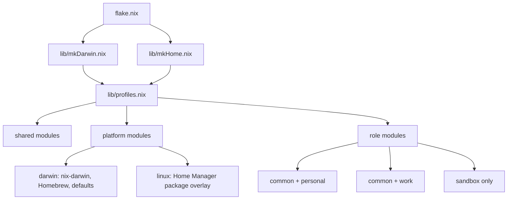

# Nix Architecture

This repo is a flake-based dotfiles setup with two composition axes:

- role: `common`, `personal`, `work`, `sandbox`
- platform: `darwin`, `linux`

The goal is to keep the shared behavior in one place, add platform policy only where it belongs, and let role-specific overlays stay thin until there is a real reason to diverge.

## Mental model

- `common` is not a deployable output on its own. It is the shared layer for `personal` and `work`.
- `personal` is `common + personal`.
- `work` is `common + work`.
- `sandbox` is a standalone profile for agent sandboxes. It does not import the public `common` role.
- `darwin` adds `nix-darwin`, Homebrew integration, and macOS defaults.
- `linux` adds Linux-only Home Manager modules and Nix packages.

That means the final configuration is always built from:

```text
shared defaults + platform layer + role layer
```

## Output map

The flake exposes three categories of outputs:

- Darwin system roles:
  - `darwinConfigurations.personal`
  - `darwinConfigurations.work`
- Linux user profiles:
  - `homeConfigurations.personal-linux`
  - `homeConfigurations.personal-aarch64-linux`
  - `homeConfigurations.work-linux`
  - `homeConfigurations.work-aarch64-linux`
- Sandbox user profiles:
  - `homeConfigurations.sandbox-aarch64-darwin`
  - `homeConfigurations.sandbox-aarch64-linux`
  - `homeConfigurations.sandbox-x86_64-linux`

`personal` and `work` are full macOS system configurations on Darwin. On Linux they are Home Manager profiles.

The user-bound outputs resolve the current login user at evaluation time. `bootstrap.sh` passes the required flags automatically; direct `darwin-rebuild`, `home-manager`, `nix build`, and `nix flake check` commands that touch these outputs should include `--impure`.

## How the flake composes modules

`flake.nix` is only the entrypoint. The real wiring is in `lib/`.

- `lib/mkDarwin.nix` builds Darwin hosts with `nix-darwin` and embeds Home Manager for the selected user.
- `lib/mkHome.nix` builds pure Home Manager profiles for Linux and sandbox use cases.
- `lib/profiles.nix` defines the shared module list, the role overlays, and the platform-specific module lists.

The merge order is fixed:

1. shared Home Manager modules
2. platform modules
3. Darwin-only role additions like Ghostty
4. role modules

That ordering matters because it keeps the shared defaults low in the stack and lets role-specific policy override them cleanly.



## Directory structure

```text
.
├── flake.nix
├── bootstrap.sh
├── docs/
│   └── nix/
│       └── README.md
├── home/
│   ├── .config/
│   ├── .claude/
│   ├── .codex/
│   ├── .tmux.conf
│   ├── .vimrc
│   └── .zshrc
├── lib/
│   ├── mkDarwin.nix
│   ├── mkHome.nix
│   └── profiles.nix
└── modules/
    ├── platforms/
    ├── roles/
    └── shared/
```

Use these placement rules:

- `home/` stores payload files that should land in `$HOME` or `~/.config`.
- `modules/shared/` owns reusable Home Manager behavior.
- `modules/roles/` owns role-specific policy.
- `modules/platforms/` owns platform-specific policy.
- `lib/` owns composition logic only.

## What each layer owns

### Shared modules

`modules/shared/` carries the reusable Home Manager behavior:

- `base.nix` sets `home.username`, `home.homeDirectory`, `home.stateVersion`, base session variables, and Linux target wiring.
- `files.nix` links the managed payloads from `home/`.
- `shell.nix`, `tmux.nix`, `neovim.nix`, `starship.nix`, and `vim.nix` configure the shell and editor stack.
- `agents-codex.nix` and `agents-claude.nix` manage the curated agent config that should travel between machines.
- `skill-helpers.nix` builds the Rust-backed helper commands from the managed skill source trees and puts them on `PATH`.

### Roles

`modules/roles/` is where profile intent lives:

- `common.nix` carries shared `personal`/`work` behavior, including Oh My Zsh enablement and shared CLI packages such as `spaces`.
- `personal.nix` is the personal overlay.
- `work.nix` is the work overlay.
- `sandbox.nix` is intentionally separate and stays lean.

Today `personal.nix` and `work.nix` are intentionally thin. That is deliberate. The role split exists so the repo can diverge cleanly later without rewriting the composition model.

### Platforms

`modules/platforms/darwin/` owns the macOS-only policy:

- `default.nix` imports the Darwin platform modules.
- `homebrew.nix` declares Homebrew packages and casks through `nix-darwin`.
- `defaults.nix` owns macOS defaults like keyboard repeat settings.
- `ghostty.nix` only applies to non-sandbox Darwin roles.

`modules/platforms/linux/` owns the Linux-only package layer:

- `default.nix` imports Linux platform modules.
- `packages.nix` declares the Linux package baseline through Nix packages.

## Managed vs unmanaged state

This repo intentionally manages only the portable subset of the agent configuration.

Managed examples:

- `~/.config/nvim`
- `~/.config/zsh`
- `~/.config/starship.toml`
- `~/.vimrc`
- `~/.codex/skills/*`
- `~/.claude/README.md`
- `~/.claude/settings.json`
- selected Claude commands and skills, including `atlas`, `notion-knowledge-capture`, and `spaces`
- selected Codex prompts, the managed `~/.codex/rules/base.rules` baseline, and `~/.codex/AGENTS.md`

The active profile also builds the Rust-backed helper commands from the managed skill sources. That includes commands such as `atlas-cli`, `fetch-comments`, `classify-ci-log`, `gh-manage-pr-summarize`, and `sql-read`.
The managed `.codex` and `.claude` payloads are copied into place as regular files during activation rather than symlinked, which avoids local skill discovery issues in Codex and Claude.

Unmanaged examples:

- `~/.codex/config.toml`
- `~/.codex/auth.json`
- `~/.codex/rules/default.rules`
- `~/.codex/history.jsonl`
- `~/.codex/sessions/**`
- `~/.codex/worktrees/**`
- `~/.codex/sqlite/**`
- `~/.codex/log/**`
- other machine-local runtime state

For Codex execpolicy specifically, the flake owns `~/.codex/rules/base.rules` as the shared baseline while `~/.codex/rules/default.rules` stays writable and untracked so the local app can persist new approvals there.

The rule is simple: portable config goes in the flake, machine-local state stays out.

## Bootstrap and updates

`bootstrap.sh` is the supported macOS apply path. It is meant to be rerun.

What it does:

1. verifies the host is macOS
2. loads Nix if it is already installed
3. installs Nix if it is missing
4. loads Homebrew if it is already installed
5. installs Homebrew if it is missing
6. builds the selected Darwin system closure from this flake
7. runs `darwin-rebuild switch --flake` for the chosen role

Run bootstrap as your normal user. On a real apply, it uses `sudo` only for the final `darwin-rebuild switch` step.
That Darwin closure build now includes the locally packaged `spaces` CLI through the shared `common` role. On a real apply, nix-darwin activation also creates `/usr/local/bin/spaces` as a symlink to the Nix-built binary. `install-dependencies` does not build `spaces`, and preview-only `--dry-run` runs do not create the symlink because activation scripts do not execute.

That makes the first-install prerequisite flow:

```bash
./bootstrap.sh install-dependencies
```

Then the normal macOS workflow:

```bash
./bootstrap.sh personal
./bootstrap.sh work
```

You do not need a separate "first install" command and "later updates" command. After pulling repo changes, rerun bootstrap for your role and it will re-apply the current flake state.

Preview modes:

```bash
./bootstrap.sh personal --dry-run
./bootstrap.sh personal --dry-run --diff
./bootstrap.sh personal --dry-run --overwrite
./bootstrap.sh work --diff
```

- `--dry-run` builds the target Darwin closure but does not switch the system.
- `--dry-run` also refuses to install missing Nix or Homebrew so the preview path stays side-effect free.
- `--dry-run` only works after Nix is already installed. On a fresh Mac, run `./bootstrap.sh install-dependencies` first.
- `--diff` runs `nix store diff-closures` against `/run/current-system` when that link exists.
- By default, Home Manager backs up conflicting managed files using the `.hm-backup` suffix before replacing them.
- `--overwrite` switches bootstrap to an alternate Darwin configuration that sets `home-manager.backupFileExtension = null`, so conflicting managed files are replaced directly with no `*.hm-backup` copies.
- If `/etc/bashrc` or `/etc/zshrc` still contain unmanaged pre-nix-darwin content, bootstrap resolves that before activation.
- Without `--overwrite`, bootstrap renames each conflicting file to `*.before-nix-darwin` and continues automatically.
- With `--overwrite`, bootstrap shows a unified diff for each conflicting file and asks for confirmation before replacing it. Declining any prompt aborts the apply without changing `/etc`.

## Daily commands

If you want the explicit native commands instead of the wrapper:

```bash
darwin-rebuild switch --flake .#personal --impure
darwin-rebuild switch --flake .#work --impure
home-manager switch --flake .#personal-linux --impure
home-manager switch --flake .#personal-aarch64-linux --impure
home-manager switch --flake .#work-linux --impure
home-manager switch --flake .#work-aarch64-linux --impure
home-manager switch --flake .#sandbox-aarch64-darwin --impure
home-manager switch --flake .#sandbox-aarch64-linux --impure
home-manager switch --flake .#sandbox-x86_64-linux --impure
```

Update flake inputs when you want to move the pin:

```bash
nix flake update
```

## How to make changes safely

When adding or changing configuration:

- put portable file payloads in `home/`
- wire file deployment in `modules/shared/files.nix`
- put shared behavior in `modules/shared/`
- put role-specific behavior in `modules/roles/`
- put platform-specific behavior in `modules/platforms/`
- keep composition logic in `lib/`

Prefer the smallest layer that actually owns the behavior. Do not put Linux-only policy in a shared module, and do not put role-specific behavior into `flake.nix`.

## Verification

The intended validation path is:

```bash
nix run .#spaces -- --help
nix flake check --impure
nix build --impure .#darwinConfigurations.personal.system
nix build --impure .#darwinConfigurations.work.system
nix build --impure .#homeConfigurations.personal-linux.activationPackage
nix build --impure .#homeConfigurations.work-linux.activationPackage
nix build --impure .#homeConfigurations.sandbox-aarch64-darwin.activationPackage
nix build --impure .#homeConfigurations.sandbox-aarch64-linux.activationPackage
nix build --impure .#homeConfigurations.sandbox-x86_64-linux.activationPackage
```

For Linux smoke tests in a fresh Ubuntu container:

```bash
./tests/run-linux-docker-smoke.sh
```

Docker covers the Linux Home Manager profiles. It does not cover `nix-darwin`, Homebrew integration, or the macOS bootstrap path.
