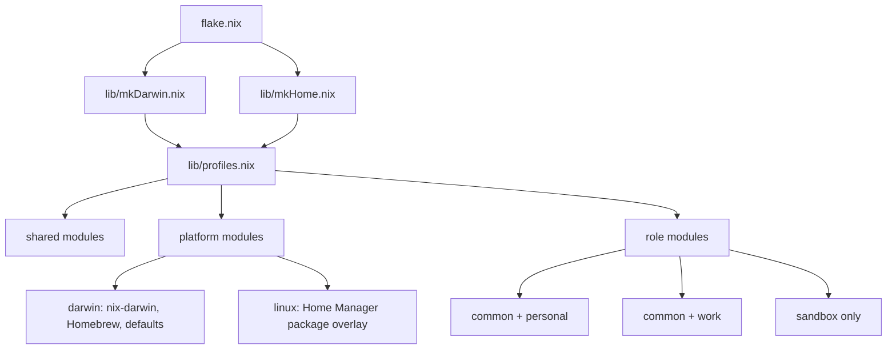

# Nix Architecture

This repo is a flake-based dotfiles setup with two composition axes:

- role: `common`, `personal`, `work`, `sandbox`
- platform: `darwin`, `linux`

The goal is to keep the shared behavior in one place, add platform policy only where it belongs, and let role-specific overlays stay thin until there is a real reason to diverge.

## Mental model

- `common` is not a deployable output on its own. It is the shared layer for `personal` and `work`.
- `personal` is `common + personal`.
- `work` is `common + work`.
- `sandbox` is a standalone profile for agent sandboxes. It does not import the public `common` role.
- `darwin` adds `nix-darwin`, Homebrew integration, and macOS defaults.
- `linux` adds Linux-only Home Manager modules and Nix packages.

That means the final configuration is always built from:

```text
shared defaults + platform layer + role layer
```

## Output map

The flake exposes three categories of outputs:

- Darwin system roles:
  - `darwinConfigurations.personal`
  - `darwinConfigurations.work`
- Linux user profiles:
  - `homeConfigurations.personal-linux`
  - `homeConfigurations.personal-aarch64-linux`
  - `homeConfigurations.work-linux`
  - `homeConfigurations.work-aarch64-linux`
- Sandbox user profiles:
  - `homeConfigurations.sandbox-aarch64-darwin`
  - `homeConfigurations.sandbox-aarch64-linux`
  - `homeConfigurations.sandbox-x86_64-linux`

`personal` and `work` are full macOS system configurations on Darwin. On Linux they are Home Manager profiles.

The user-bound outputs resolve the current login user at evaluation time. `bootstrap.sh` passes the required flags automatically; direct `darwin-rebuild`, `home-manager`, `nix build`, and `nix flake check` commands that touch these outputs should include `--impure`.

## How the flake composes modules

`flake.nix` is only the entrypoint. The real wiring is in `lib/`.

- `lib/mkDarwin.nix` builds Darwin hosts with `nix-darwin` and embeds Home Manager for the selected user.
- `lib/mkHome.nix` builds pure Home Manager profiles for Linux and sandbox use cases.
- `lib/profiles.nix` defines the shared module list, the role overlays, and the platform-specific module lists.

The merge order is fixed:

1. shared Home Manager modules
2. platform modules
3. Darwin-only role additions like Ghostty
4. role modules

That ordering matters because it keeps the shared defaults low in the stack and lets role-specific policy override them cleanly.


```mermaid
flowchart TD
    A["flake.nix"] --> B["lib/mkDarwin.nix"]
    A --> C["lib/mkHome.nix"]
    B --> D["lib/profiles.nix"]
    C --> D
    D --> E["shared modules"]
    D --> F["platform modules"]
    D --> G["role modules"]
    F --> H["darwin: nix-darwin, Homebrew, defaults"]
    F --> I["linux: Home Manager package overlay"]
    G --> J["common + personal"]
    G --> K["common + work"]
    G --> L["sandbox only"]
```

## Directory structure

```text
.
├── flake.nix
├── bootstrap.sh
├── docs/
│   └── nix/
│       └── README.md
├── home/
│   ├── .config/
│   ├── .claude/
│   ├── .codex/
│   ├── .vimrc
│   └── .zshrc
├── lib/
│   ├── mkDarwin.nix
│   ├── mkHome.nix
│   └── profiles.nix
└── modules/
    ├── platforms/
    ├── roles/
    └── shared/
```

Use these placement rules:

- `home/` stores payload files that should land in `$HOME` or `~/.config`.
- `modules/shared/` owns reusable Home Manager behavior.
- `modules/roles/` owns role-specific policy.
- `modules/platforms/` owns platform-specific policy.
- `lib/` owns composition logic only.

## What each layer owns

### Shared modules

`modules/shared/` carries the reusable Home Manager behavior, grouped by domain, each with a `default.nix` aggregator:

- `base.nix` sets `home.username`, `home.homeDirectory`, `home.stateVersion`, base session variables, and Linux target wiring.
- `files.nix` links the managed payloads from `home/`.
- `shell/` owns the interactive shell stack: `zsh.nix`, `herdr.nix` (the terminal multiplexer: Homebrew on Darwin, the herdr flake elsewhere), and the starship package.
- `editors/` owns the editor stack: `neovim.nix` plus the neovim/vim packages on platforms that do not get them from Homebrew.
- `agents/` owns everything agent-related: `managed-copies.nix`, `mcp-servers.nix`, `claude.nix`, `codex.nix`, and `skill-helpers.nix` (the Rust-backed helper commands on `PATH`).

### Roles

`modules/roles/` is where profile intent lives:

- `common.nix` carries shared `personal`/`work` behavior, including Oh My Zsh enablement and shared CLI packages such as `docker`, `postgresql`, and `ripgrep`.
- `personal.nix` is the personal overlay.
- `work.nix` is the work overlay.
- `sandbox.nix` is intentionally separate and stays lean.

Today `personal.nix` and `work.nix` are intentionally thin. That is deliberate. The role split exists so the repo can diverge cleanly later without rewriting the composition model.

### Platforms

`modules/platforms/darwin/` owns the macOS-only policy, split by evaluation target:

- `system/` holds the `nix-darwin` system modules: `homebrew.nix` (Homebrew packages and casks, plus work-only private taps and casks from ignored env state) and `defaults.nix` (macOS defaults like keyboard repeat settings).
- `home/` holds the Home Manager modules that only apply to non-sandbox Darwin roles: `packages.nix`, `ghostty.nix`, `nvm.nix`, and `pnpm.nix`. The nvm activation provisions a missing default Node runtime after Homebrew installs nvm; an installed default is reused without upgrading it.

`modules/platforms/linux/` owns the Linux-only package layer:

- `default.nix` imports Linux platform modules.
- `packages.nix` declares the Linux package baseline through Nix packages.

## Managed vs unmanaged state

This repo intentionally manages only the portable subset of the agent configuration.

Managed examples:

- `~/.config/nvim`
- `~/.config/zsh`
- `~/.config/starship.toml`
- `~/.vimrc`
- `~/.codex/skills/*` and `~/.claude/skills/*`, copied from the repo's canonical `skills/` tree (excluding work-only skills)
- `~/.claude/README.md`
- `~/.claude/settings.json`
- `~/.claude/CLAUDE.md`
- the managed `~/.codex/rules/base.rules` baseline and `~/.codex/AGENTS.md`

Darwin profiles additionally manage the `atlas` skill for both Codex and Claude. The work profile also manages the `observe` skill for both agents.
It applies a targeted merge to `~/.codex/config.toml` for Codex's Notion remote MCP connection:

```toml
[features]
rmcp_client = true

[mcp_servers.notion]
url = "https://mcp.notion.com/mcp"
```

That merge intentionally touches only those keys. Notion OAuth state remains local; on a new machine, run `codex mcp login notion` after applying the work profile.

The active profile also builds the Rust-backed helper commands from the managed skill sources. That includes commands such as `atlas-cli`, `fetch-comments`, `classify-ci-log`, and `sql-read`. Adding an image or video to a PR body uses `gh`'s built-in `--attach` flag (gh 2.99.0+), as described in the `gh-manage-pr` and `gh-pr-body` skills.
The managed `.codex` and `.claude` payloads are copied into place as regular files during activation rather than symlinked, which avoids local skill discovery issues in Codex and Claude.

Unmanaged examples:

- `~/.codex/config.toml`, except for the work profile's targeted Notion MCP merge
- `~/.codex/auth.json`
- `~/.codex/rules/default.rules`
- `~/.codex/history.jsonl`
- `~/.codex/sessions/**`
- `~/.codex/worktrees/**`
- `~/.codex/sqlite/**`
- `~/.codex/log/**`
- other machine-local runtime state

For Codex execpolicy specifically, the flake owns `~/.codex/rules/base.rules` as the shared baseline while `~/.codex/rules/default.rules` stays writable and untracked so the local app can persist new approvals there.

The rule is simple: portable config goes in the flake, machine-local state stays out.

## Bootstrap and updates

`bootstrap.sh` is the supported macOS and Debian Linux apply path. It is meant to be rerun.

What it does:

1. selects macOS or Linux (x86-64 / ARM64)
2. loads Nix if it is already installed
3. installs Nix if it is missing; on Debian, first installs `ca-certificates`, `curl`, `git`, and `xz-utils` through apt
4. on macOS, loads Homebrew or installs it if missing
5. builds the selected Darwin system closure or Linux Home Manager activation package from this flake
6. runs `darwin-rebuild switch --flake` on macOS or the built Home Manager activation script on Linux

Run bootstrap as your normal user, without sudo. On Debian, sudo must already be installed and available to your user for prerequisite installation. Nix is installed in multi-user mode when systemd is running, or single-user mode otherwise; an existing Nix installation is reused. Home Manager activation runs as your user. On macOS, prerequisite installation and `darwin-rebuild switch` may require sudo.

That makes the first-install prerequisite flow:

```bash
./bootstrap.sh install-dependencies
```

Then the normal macOS or Debian workflow:

```bash
./bootstrap.sh personal
./bootstrap.sh work
```

You do not need a separate "first install" command and "later updates" command. After pulling repo changes, rerun bootstrap for your role and it will re-apply the current flake state.

Linux selects `personal-linux` / `work-linux` on x86-64 and `personal-aarch64-linux` / `work-aarch64-linux` on ARM64. The Linux path lives in `scripts/bootstrap-linux.sh`; it does not run Homebrew, load private Homebrew environment files, or modify `/etc` shell files.

Preview modes:

```bash
./bootstrap.sh personal --dry-run
./bootstrap.sh personal --dry-run --diff
./bootstrap.sh personal --dry-run --overwrite
./bootstrap.sh work --diff
```

- `--dry-run` builds the target closure but does not activate it.
- `--dry-run` also refuses to install missing Nix or Homebrew so the preview path stays side-effect free.
- `--dry-run` only works after Nix is already installed. On a fresh machine, run `./bootstrap.sh install-dependencies` first.
- `--diff` runs `nix store diff-closures` against `/run/current-system` on macOS or the active Home Manager generation on Linux. Without an existing generation it reports the missing baseline and continues.
- By default, Home Manager backs up conflicting managed files using the `.hm-backup` suffix before replacing them.
- `--overwrite` switches bootstrap to an alternate Darwin configuration that sets `home-manager.backupFileExtension = null`, so conflicting managed files are replaced directly with no `*.hm-backup` copies.
- On Linux, the default activation sets `HOME_MANAGER_BACKUP_EXT=hm-backup`. `--overwrite` selects `homeConfigurations.<profile>-overwrite`, which enables the same managed-file force policy as macOS, and clears the backup extension for activation.
- On macOS, if `/etc/bashrc` or `/etc/zshrc` still contain unmanaged pre-nix-darwin content, bootstrap resolves that before activation.
- Without `--overwrite`, bootstrap renames each conflicting file to `*.before-nix-darwin` and continues automatically.
- With `--overwrite`, bootstrap shows a unified diff for each conflicting file and asks for confirmation before replacing it. Declining any prompt aborts the apply without changing `/etc`.

Private work-only Homebrew taps and casks should stay out of tracked files. Bootstrap loads `.dotfiles-private.env` from the repo root when present; that file is ignored by git and currently supports these entries:

```bash
DOTFILES_WORK_HOMEBREW_TAPS=owner/tap
DOTFILES_WORK_HOMEBREW_TAP_CLONE_TARGETS=owner/tap=git@github.com:owner/homebrew-tap.git
DOTFILES_WORK_HOMEBREW_CASKS=private-cask
```

Use colon separation for more than one plain tap or cask. Use semicolon separation for more than one `tap=clone_target` entry because SSH clone targets contain colons. If a tap appears in both `DOTFILES_WORK_HOMEBREW_TAPS` and `DOTFILES_WORK_HOMEBREW_TAP_CLONE_TARGETS`, the clone-target entry wins. These variables are ignored unless the Darwin role is `work`. Bootstrap trusts private taps as the Homebrew activation user and forwards the variables through the final `sudo` apply so the flake sees the same values during `darwin-rebuild`.

## Daily commands

If you want the explicit native commands instead of the wrapper:

```bash
darwin-rebuild switch --flake .#personal --impure
darwin-rebuild switch --flake .#work --impure
home-manager switch --flake .#personal-linux --impure
home-manager switch --flake .#personal-aarch64-linux --impure
home-manager switch --flake .#work-linux --impure
home-manager switch --flake .#work-aarch64-linux --impure
home-manager switch --flake .#sandbox-aarch64-darwin --impure
home-manager switch --flake .#sandbox-aarch64-linux --impure
home-manager switch --flake .#sandbox-x86_64-linux --impure
```

Update flake inputs when you want to move the pin:

```bash
nix flake update
```

## How to make changes safely

When adding or changing configuration:

- put portable file payloads in `home/`
- wire file deployment in `modules/shared/files.nix`
- put shared behavior in `modules/shared/`
- put role-specific behavior in `modules/roles/`
- put platform-specific behavior in `modules/platforms/`
- keep composition logic in `lib/`

Prefer the smallest layer that actually owns the behavior. Do not put Linux-only policy in a shared module, and do not put role-specific behavior into `flake.nix`.

## Verification

Fast local checks:

```bash
bash tests/bootstrap-platform-smoke.sh
bash tests/nvim-external-write-merge-smoke.sh
bash tests/nvim-monorepo-routing-smoke.sh
bash scripts/test-skill-helpers.sh
```

The Neovim checks expect the relevant lazy.nvim plugin checkouts to already exist under `~/.local/share/nvim/lazy`. `scripts/test-skill-helpers.sh` expects Rust and the helper crates' offline dependencies to be available.

The intended validation path is:

```bash
nix flake check --impure
nix build --impure .#darwinConfigurations.personal.system
nix build --impure .#darwinConfigurations.personal-overwrite.system
nix build --impure .#darwinConfigurations.work.system
nix build --impure .#darwinConfigurations.work-overwrite.system
nix build --impure .#homeConfigurations.personal-linux.activationPackage
nix build --impure .#homeConfigurations.work-linux.activationPackage
nix build --impure .#homeConfigurations.sandbox-aarch64-darwin.activationPackage
nix build --impure .#homeConfigurations.sandbox-aarch64-linux.activationPackage
nix build --impure .#homeConfigurations.sandbox-x86_64-linux.activationPackage
```

For Linux smoke tests in a fresh Ubuntu container:

```bash
./tests/run-linux-docker-smoke.sh
```

For Debian bootstrap, including real prerequisite installation and a minimal Home Manager activation:

```bash
docker build -f tests/docker/debian/Dockerfile -t dotfiles-bootstrap-debian .
docker run --rm dotfiles-bootstrap-debian
```

The Debian test evaluates the production personal/work profiles for both Linux architectures, then exercises preview, diff, backup, and overwrite using a minimal Home Manager payload with the repo's pinned inputs. It does not build the full development package set. Docker does not cover `nix-darwin`, Homebrew integration, or the macOS bootstrap path.
